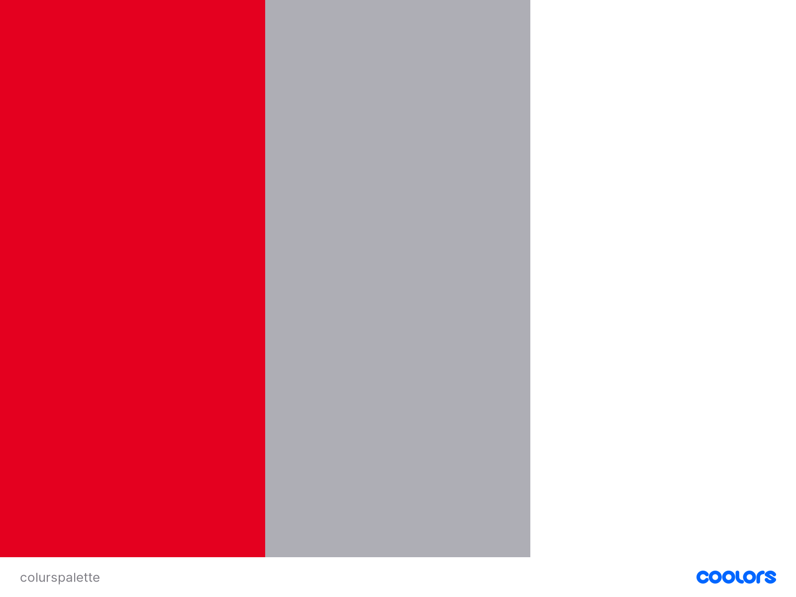

## Super Mario the Nintendo Icon

### Super Mario Helped Nintendo Conquer the Video Game World

### Description
#### I decide to buikd this website for those who enjoyed palying videogames back in the 80's and specifically the 8 bit era for the Nintendo users. What I want is let user find information about the best videogames for this console and why Super Mario became the face of the system. 

## Table of Content
* UX
  * Project Goals
  * User Goals
  * User Stories
  * Site Owner Goal
  * User Requirements and Expectations
  * Design
    * Fonts
    * Icons
    * Colours
* Technologies used
* Features
    * Develped Features
    * Future implementation
* Testing
* Bugs 
* Deployment
* Credit
# User Experience
___
## The Project Goal
##### When I first thinking of this project the idea was to build a website for the generation X users who enjoyed the NES system and  the library of their videogames but maybe they hanging up the controller. 

## User Goal
* Find information Super Mario saga.
* Get to know Super Mario and why is the most popular game ever.
* Images of Super Mario + funny images from internet artist.
* Have a look to the Mario World and the merchandising.
* Send email to the site owner to get specific information.

## User Story
| Users      |    
| -------   

* [ Mark ] User 1
* [ Rory ] User 2
* [ Claudio ] User 3

User 1: As a mobile user I need a smooth navigation  through the web page, I want the main information visible once that I click on links.
 
| Acceptance Criteria     |    
| -------   

Ensure the user1 is able to:
* See the navigation bar clear;
* Navigate to each section by click on links;
* Able to easily read title of the article after link has been clicked.

User 2: As a millennials videogamer I want to know more about the creator, the game library and the story of how the game evolved since the first publication.

| Acceptance Criteria     |    
| -------   

Ensure the user2 is able to:
* Easily find related information on the top of the page;
* Read a brief introduction of the game main character and how it became so famous;
* On the same section user can click a video content about all the stories behind Super Mario publication, how Mario get new super power and when new characher were added to the series.

User 3: As a Super Mario fan I want to see more funny contents about mario and find related  online shop where I can buy articles for my self and family.

| Acceptance Criteria     |    
| -------   

Ensure the user3 is able to:
* Read content about videogame franchises.
* Find information about merchandising and being riderect to an online reseller of Super Mario Brand.
* Able to clink on a button and being redirect to some cool web blog/ page or articles that talking about funny memes or cool animation.
___

* As a user what I'm looking for is an attractive webiste where I can spend time and reading interesting information about retro videogames.
* I want to find information about Nintendo 8 bit and the raise of the 8 bit era.
* As a user I want to know more about Super Mario Bros, when was created and the evolution of the character.
* I want to be able to contact the site owner for more details and information about this game.

## Website Owner Goals
* My Goal as a site owner is to inform my users about the 8 bit gaming generation.
* I want to communicate how important was Super Mario for my generation and the story behind this amazing character.
* As a site owner is very important to get in touch with my users and answer any topic about gaming experience and fun fact.

## Customer requirements and expectations
1. Requirements
* Easy navigation using navbar -High-
* Each section most have main information displayed -High-
* Content dipslayed in a fancy way -Medium-
* intuitive Contact form -High-

2. Expectations
* All the content structured displayed with all the main information.
* Navigation redirect users to the specific part of the website.
* Read more button redirect user to useful information related the article.
* External resource used in the website will provide great informastion and topics.

## The Design
___
#### I got the first inspiration when I start to design this website from [Nintendo](https://www.nintendo.com/nes-classic/) classics website, I actually try to make a restyling of it with my personal touch, but I wasn't happy enough after the first view, so I decide to make my own design.

### Icons
Icons used were provided by [Font Awesome](https://fontawesome.com/)

### Colours

#### I decide to use colours that reminds the user the original NES console.

* The body is a combination of #E4001F and #FFF;
* For the Navbar I actually choose the same grey that Nintendo used #AEAEB5;

## Features
___

### Features implemented:
* Resposnsive navigation on all screensizes.
* Stylish design.
* Video's.
* Contact Form.
* Social media links.

### Features that will be implemented in the future:
* Another Video section.
___
## Technologies used
___
## Languages
* [HTML](https://developer.mozilla.org/en-US/docs/Web/HTML)
* [CSS](https://developer.mozilla.org/en-US/docs/Web/CSS)
## Tools & Libraries
* [Bootstrap](https://getbootstrap.com/docs/5.0/getting-started/introduction/)
* [Font-Awesome](https://fontawesome.com/)
* [Google fonts](https://fonts.google.com/)

## Testing
___
Testing HTML with  [HTML Validator](https://validator.w3.org/), first results:
* Warning
    * heading section lacks heading
    * section section lacks heading

* Errors
    * form action " " cannot be empty
    * end tag for emelemt /div which is not open

* Fixes
    * changed heading and section to div
    * Removed action in the form attribute as no needed for this project
    * Removed end tag for for the div which was not opened

Testing CSS with [CSS Validator](https://jigsaw.w3.org/css-validator/), no errors found.

#### Responsiveness
* Bootstrap implemented throughout the project to ensure mobile first responsive and   tested with devtools and Lambdatest.

* **Result** was successfull and as to be expected.

#### Design
* **Implementation** got inspiration from the official Mario website of Nintendo but not following any particular pattern, I decide to use diagonal separator for each section and using fonts and images that reminds me the game also to give sense of familiarity for those who knows the game.

* **Results** I'm quite happy as I made something original but consistent with the videogame character.

### Contact Form
* **Implementation** I got the contact form from the Bootstrap site and made few changes to meet my needs, Form validation was implemented to ensure that user put values to any field before sending the email.

* **Results** Contact form works as expected.
* **Verdict** Validation works, test passed.

## Deployment
___
The Origins of Super mario was developed on **GitPod** and host the repository.

When deploying The origins of Super Mario, the following steps were made:

* **GitHub** opened in the broser.
* Sign in  using username and password.
* Selected my repositories.
* Clicked **Settings** on the top navigation.
* Scrolled down to GitHub pages.
* Selected **Master-Branch** from the drop-down menu.
* The Origins of Super Mario is now live on GitHub Pages.

## Credits
___
* [Article](https://www.bbc.com/news/newsbeat-54163659) by Christian Hewgill.
* [Article](https://www.popmatters.com/141240-the-retirement-of-a-gen-x-gamer-or-my-8-bit-childhood-2496029806.html) by Clay Morgan.
* [Article](https://ultimateclassicrock.com/super-mario-bros-history/)

### Images used
* [Pinterest](https://www.pinterest.ie/)
* [IconArchive](https://iconarchive.com/)

### Special Thanks
* To my great mentor [Simen Daehlin](https://github.com/Eventyret)